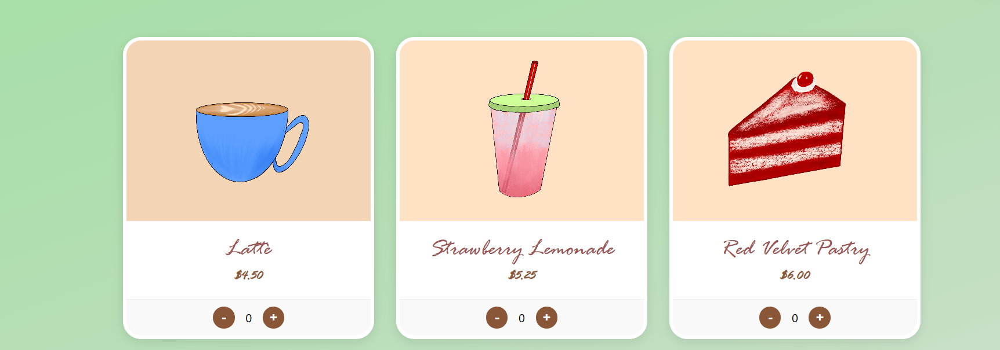
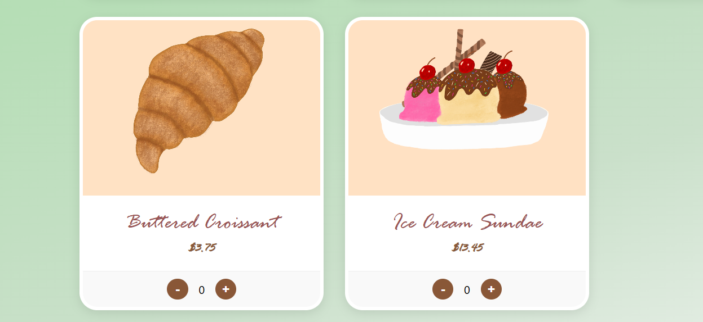
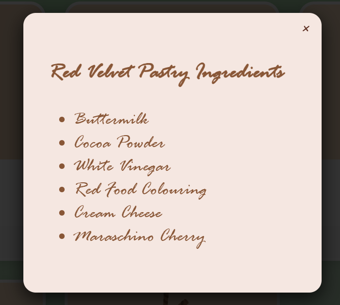
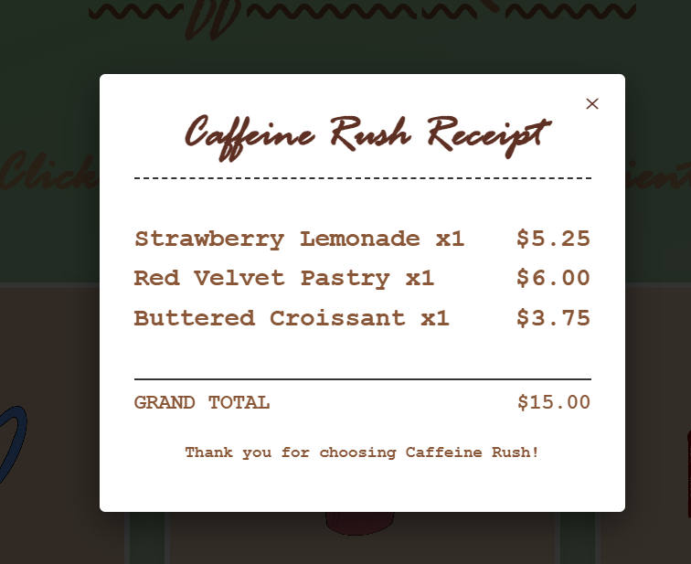

# Caffeine Rush

Caffeine Rush is a responsive café ordering web application built using HTML, CSS, and JavaScript. The application allows users to browse menu items, add products to a shopping cart, and view a dynamically updated bill during checkout.

Live Demo: https://anvesha-verma.github.io/caffeine-rush/

## Features

- Responsive and user-friendly interface
- Browse a curated café menu
- See ingredients of each item
- Add and remove items to and from the shopping cart
- Dynamic bill calculation and checkout updates
- Real-time cart management using JavaScript
- Custom illustrations and visual assets created specifically for the project

## Technologies Used

- HTML5
- CSS3
- JavaScript (ES6)

## Concepts Used

- DOM Manipulation for real-time cart updates
- Event Handling for user interactions
- Dynamic Bill Calculation
- Array and Object Management in JavaScript
- Responsive Web Design using CSS

## How It Works

1. Users browse the available menu items and see their ingredients by a click on their card.
2. Items can be added to the cart with a single click.
3. The cart updates instantly without refreshing the page.
4. Users can remove items from the cart at any time.
5. The total bill is automatically recalculated whenever items are added or removed.

## Screenshots

### Home Page

### Menu Page

### Ingredients Page

### Bill

## Future Improvements

- Search and filtering functionality
- Item quantity management
- Persistent cart using Local Storage
- Backend integration for order processing

## Author

**Anvesha Verma**

GitHub: https://github.com/anvesha-verma

If you have any suggestions or feedback, feel free to reach out.
